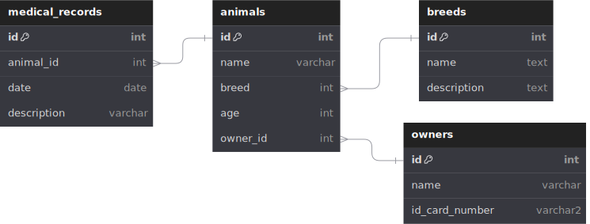

# Állatorvosi Nyilvántartó Rendszer - Fejlesztői Dokumentáció

- [Állatorvosi Nyilvántartó Rendszer - Fejlesztői Dokumentáció](#állatorvosi-nyilvántartó-rendszer---fejlesztői-dokumentáció)
  - [Technológiai Stack](#technológiai-stack)
  - [Architektúra és Rendszerterv](#architektúra-és-rendszerterv)
    - [Általános Architektúra](#általános-architektúra)
    - [Komponensek és Interakciók](#komponensek-és-interakciók)
    - [Adatfolyam](#adatfolyam)
    - [Adatbázis terv](#adatbázis-terv)
  - [!a](#)
  - [Telepítési Lépések](#telepítési-lépések)
  - [API Dokumentáció](#api-dokumentáció)
    - [Állatok](#állatok)
      - [GET /api/animals](#get-apianimals)
      - [GET /api/animals/{id}](#get-apianimalsid)
      - [POST /api/animals](#post-apianimals)
      - [PUT /api/animals/{id}](#put-apianimalsid)
      - [DELETE /api/animals/{id}](#delete-apianimalsid)
    - [Kórlapok](#kórlapok)
      - [GET /api/medicalrecords](#get-apimedicalrecords)
      - [GET /api/medicalrecords/{id}](#get-apimedicalrecordsid)
      - [POST /api/medicalrecords](#post-apimedicalrecords)
      - [PUT /api/medicalrecords/{id}](#put-apimedicalrecordsid)
      - [DELETE /api/medicalrecords/{id}](#delete-apimedicalrecordsid)
    - [Gazdák](#gazdák)
      - [GET /api/owners](#get-apiowners)
      - [GET /api/owners/{id}](#get-apiownersid)
      - [POST /api/owners](#post-apiowners)
      - [PUT /api/owners/{id}](#put-apiownersid)
      - [DELETE /api/owners/{id}](#delete-apiownersid)
  - [Clean Code ajánlások és irányelvek](#clean-code-ajánlások-és-irányelvek)
    - [Bevezetés](#bevezetés)
    - [Általános Irányelvek](#általános-irányelvek)
      - [Nevezéktan](#nevezéktan)
      - [Kommentek](#kommentek)
      - [Formázás](#formázás)
    - [Strukturális Irányelvek](#strukturális-irányelvek)
      - [Függvények](#függvények)
      - [Osztályok](#osztályok)
    - [Kódolási Irányelvek](#kódolási-irányelvek)
      - [Hibakezelés](#hibakezelés)
      - [Tesztelhetőség](#tesztelhetőség)
    - [Verziókezelés](#verziókezelés)
      - [Commit üzenetek](#commit-üzenetek)
    - [Példák](#példák)
      - [Rossz példa](#rossz-példa)
      - [Jó példa](#jó-példa)

## Technológiai Stack

- **Backend**:
  - ASP.NET Core
  - Entity Framework Core

- **Frontend**:
  - WPF (Windows Presentation Foundation)
  - HTML, CSS, JavaScript, React.js vagy Angular

- **Adatbázis**:
  - SQLite


## Architektúra és Rendszerterv

### Általános Architektúra

- **Frontend**:
  - WPF alkalmazás (C#)
  - Webes felület (HTML, CSS, JavaScript, React.js vagy Angular)
  
- **Backend**:
  - ASP.NET Core Web API

- **Adatbázis**:
  - SQLite

### Komponensek és Interakciók

1. **WPF Desktop Dashboard**: Kommunikál a backenddel HTTP kérések segítségével.
2. **Web Dashboard**: Kommunikál a backenddel HTTP kérések segítségével.
3. **Backend API**: Kérések fogadása és válaszok küldése a frontend számára, adatbázis műveletek végrehajtása.
4. **Adatbázis**: Az adatok tárolása és lekérése a backend API által.

### Adatfolyam

1. A felhasználó műveletet végez a dashboardon.
2. A dashboard HTTP kérést küld a backendnek.
3. A backend feldolgozza a kérést és kommunikál az adatbázissal.
4. Az adatbázis választ küld a backendnek.
5. A backend választ küld a dashboardnak.
6. A dashboard megjeleníti a választ a felhasználónak.

### Adatbázis terv

---


## Telepítési Lépések

1. **Backend Telepítés**:
   - Visual Studio használata az ASP.NET Core projekt létrehozásához és futtatásához.
   - Az adatbázis konfigurálása és migrációk végrehajtása.

2. **Frontend Telepítés (WPF)**:
   - Visual Studio használata a WPF projekt létrehozásához és futtatásához.

3. **Frontend Telepítés (Web)**:
   - Node.js és npm használata a frontend fejlesztéséhez.
   - A projekt buildelése és a statikus fájlok hosztolása.


## API Dokumentáció

### Állatok

#### GET /api/animals

- **Leírás**: Az összes állat adatainak lekérése.
- **Válasz**: 200 OK, az állatok listájával.

#### GET /api/animals/{id}

- **Leírás**: Egy konkrét állat adatainak lekérése.
- **Paraméterek**: 
  - `id` (int): Az állat azonosítója.
- **Válasz**: 200 OK, az állat adataival.

#### POST /api/animals

- **Leírás**: Új állat hozzáadása.
- **Body**: Az állat adatai (JSON formátumban).
- **Válasz**: 201 Created, az új állat adataival.

#### PUT /api/animals/{id}

- **Leírás**: Egy állat adatainak frissítése.
- **Paraméterek**: 
  - `id` (int): Az állat azonosítója.
- **Body**: Az állat frissített adatai (JSON formátumban).
- **Válasz**: 200 OK, a frissített állat adataival.

#### DELETE /api/animals/{id}

- **Leírás**: Egy állat adatainak törlése.
- **Paraméterek**: 
  - `id` (int): Az állat azonosítója.
- **Válasz**: 204 No Content.

### Kórlapok

#### GET /api/medicalrecords

- **Leírás**: Az összes kórlap adatainak lekérése.
- **Válasz**: 200 OK, a kórlapok listájával.

#### GET /api/medicalrecords/{id}

- **Leírás**: Egy konkrét kórlap adatainak lekérése.
- **Paraméterek**: 
  - `id` (int): A kórlap azonosítója.
- **Válasz**: 200 OK, a kórlap adataival.

#### POST /api/medicalrecords

- **Leírás**: Új kórlap hozzáadása.
- **Body**: A kórlap adatai (JSON formátumban).
- **Válasz**: 201 Created, az új kórlap adataival.

#### PUT /api/medicalrecords/{id}

- **Leírás**: Egy kórlap adatainak frissítése.
- **Paraméterek**: 
  - `id` (int): A kórlap azonosítója.
- **Body**: A kórlap frissített adatai (JSON formátumban).
- **Válasz**: 200 OK, a frissített kórlap adataival.

#### DELETE /api/medicalrecords/{id}

- **Leírás**: Egy kórlap adatainak törlése.
- **Paraméterek**: 
  - `id` (int): A kórlap azonosítója.
- **Válasz**: 204 No Content.

### Gazdák

#### GET /api/owners

- **Leírás**: Az összes gazda adatainak lekérése.
- **Válasz**: 200 OK, a gazdák listájával.

#### GET /api/owners/{id}

- **Leírás**: Egy konkrét gazda adatainak lekérése.
- **Paraméterek**: 
  - `id` (int): A gazda azonosítója.
- **Válasz**: 200 OK, a gazda adataival.

#### POST /api/owners

- **Leírás**: Új gazda hozzáadása.
- **Body**: A gazda adatai (JSON formátumban).
- **Válasz**: 201 Created, az új gazda adataival.

#### PUT /api/owners/{id}

- **Leírás**: Egy gazda adatainak frissítése.
- **Paraméterek**: 
  - `id` (int): A gazda azonosítója.
- **Body**: A gazda frissített adatai (JSON formátumban).
- **Válasz**: 200 OK, a frissített gazda adataival.

#### DELETE /api/owners/{id}

- **Leírás**: Egy gazda adatainak törlése.
- **Paraméterek**: 
  - `id` (int): A gazda azonosítója.
- **Válasz**: 204 No Content.


## Clean Code ajánlások és irányelvek

### Bevezetés
A következő irányelvek célja, hogy segítsenek a fejlesztőknek tiszta, könnyen olvasható és karbantartható kódot írni. A tiszta kód javítja a fejlesztési folyamatot, és könnyebbé teszi a hibajavítást és a bővítést.
\ 
>Minden le nem fedett esetben a  [Microsoft irányelvei](https://learn.microsoft.com/en-us/dotnet/standard/design-guidelines/) illetve [Robert C. Martin](https://gist.github.com/wojteklu/73c6914cc446146b8b533c0988cf8d29) ajánlásai irányadóak.

### Általános Irányelvek

#### [Nevezéktan](https://learn.microsoft.com/en-us/dotnet/standard/design-guidelines/naming-guidelines)
- **Beszédes nevek**: Használj érthető, beszédes neveket változóknak, függvényeknek és osztályoknak.
- **Konzisztencia**: Tartsd meg a konzisztens nevezéktant a teljes kódbázisban.
- **Kerüld a rövidítéseket**: Kerüld a rövidítéseket, kivéve ha azok széles körben elfogadottak (pl. `min`, `max`).
- **PascalCasing használata**: minden publikus tagra, típusra, namespace-re, stb.
- **camelCasing használata**: Minden paraméterre
- 

#### Kommentek
- **Magyarázó kommentek**: Csak akkor használj kommenteket, ha a kód nem egyértelmű. A jól megírt kód önmagáért beszél.
- **Dokumentációs kommentek**: Használj dokumentációs kommenteket a függvények és osztályok fölött, hogy leírják azok célját és használatát.

#### Formázás
- **Behúzás**: Használj következetes behúzást (pl. 4 szóköz vagy 1 tabulátor).
- **Sorhossz**: Tartsd meg a sorhosszt 80-120 karakter között.
- **Üres sorok**: Használj üres sorokat a kód logikai részeinek elválasztására.

### Strukturális Irányelvek

#### Függvények
- **Kis függvények**: Írj kis, egy dolgot végző függvényeket. Ha egy függvény túl hosszú, bontsd kisebb részekre.
- **Egy szintű absztrakció**: Egy függvény csak egy szintű absztrakcióval dolgozzon.

#### Osztályok
- **Kis osztályok**: Az osztályok legyenek kicsik, és egyértelműen meghatározott feladatkörük legyen.
- **Egység elve**: Egy osztály csak egy dolgot csináljon, de azt jól.

### Kódolási Irányelvek

#### Hibakezelés
- **Kivételkezelés**: Használj kivételkezelést a hibák kezelésére. Ne hagyj üres `catch` blokkokat.
- **Tiszta állapot**: Biztosítsd, hogy a program tiszta állapotba kerül hibakezelés után.

#### Tesztelhetőség
- **Egység tesztek**: Írj egység teszteket minden függvényhez és osztályhoz.
- **Mock objektumok**: Használj mock objektumokat a teszteléshez, hogy ne függj a külső rendszerektől.

### Verziókezelés

#### Commit üzenetek
- **Beszédes commit üzenetek**: Írj világos és érthető commit üzeneteket, amelyek leírják a változtatásokat.
- **Kis commitok**: Gyakran commitolj, és kis, jól elkülöníthető változtatásokat végezz.

### Példák

#### Rossz példa
```
public void process() {
    // feldolgozás
    for (int i = 0; i < 10; i++) {
        // valami logika
    }
}
```

#### Jó példa
```
/**
 * Adatok feldolgozása.
 */
public void processData() {
    for (int index = 0; index < MAX_ENTRIES; index++) {
        processEntry(index);
    }
}

/**
 * Egy bejegyzés feldolgozása.
 * 
 * @param index A bejegyzés indexe.
 */
private void processEntry(int index) {
    // konkrét logika itt
}
```


---
