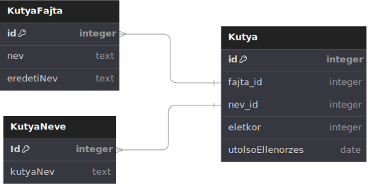

# Állatorvosi nyilvántartó rendszer rendszerterv
> [Eredeti feladatleírás alapján](https://infojegyzet.hu/vizsgafeladatok/okj-programozas/szoftverfejleszto-180531/) \
> A szaktnár által javasolt kivitelezési iránymutatások alapján

## Rendszerterv
- .NET 6 Keretrendszer használata
- WPF Használata

### Adatterv

### Adatvédelmi terv
Nem szükséges ennél a feladatnál.

### Működési terv (aka rendszer működésének terve, funkciók terve)

#### Kutyanevek számának kiírása képernyőre

#### Átlag kutyaéletkor

#### Legidősebb kutya

#### Fajtánként kutya a rendelőben az adott napon

#### Legforgsalmasabb nap

#### Névstatisztika

## Fejlesztés és dokumentáció során használt eszközök és külsős források
- [cloudconvert.com](https://cloudconvert.com/)
- [tabletomarkdown.com](https://tabletomarkdown.com/convert-spreadsheet-to-markdown/)
- [dbdiagram.io](https://dbdiagram.io/)
- [Visual Studio IDE](https://visualstudio.microsoft.com/)
- [.NET 5 keretrendszer](https://dotnet.microsoft.com/en-us/)
- [tablesgenerator.com](https://www.tablesgenerator.com/markdown_tables)
- [lucid.app](https://lucid.app/lucidchart/)
- 
- 
- 
- 
- 
- 
- 
- 
- 
- 
- 
- 
- 
- 
- 